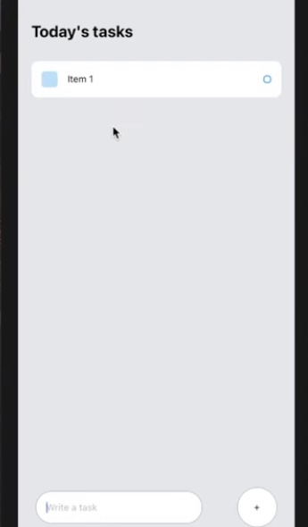

# Hack Technology / Project Attempted
### Katherine Taylor

## What you built? 

I attempted to build a to-do list app using ReactNative! Below are three pictures showing adding an item, clicking on an item to delete it, and deleting the item!  

### Adding an item:  

### Clicking on the item to delete it:

### The item is deleted!:

## Who Did What?

I did all of it!

## What you learned

What didn't work:
- I had some trouble with git. I have a good amount of experience with git and usually don't face any problems, but I think I had some complications because of the helper application the tutorial I used relied on. I used a thing called "expo" which initialized the base of the app in a folder called "todoList." But, any changes I made in this folder wouldn't be recognized by git and if I moved the files out of the folder, then the app wouldn't work. So, I don't think this would be a problem when building my own application since I wouldn't rely on expo. Because of this, I just made changes in todoList to see the changes and then removed the files from the folder to upload them to git. Because of this, I'm not sure if you clone this repo if it would actually work.
- In theory, expo would allow me to actively see the changes I was making on my phone via the expo app. However, after an hour or so of attempts I stll could not get this working :/. 

What worked:
- Expo made it really easy to get the app set up and to view the changes I made in real-time. I would certainly use it again if I wanted to play around with building an app, but probably not for a more serious project.
- I was surprised by how similar ReactNative is to React. I guess I maybe should have seen this coming, but already after making this one simple app I feel as though I could definitely code a more complicated ReactNative app, with some googling help along the way :)

## Authors

Katherine Taylor '22

## Acknowledgments

https://www.youtube.com/watch?v=0kL6nhutjQ8 + the follow-up video (part 2 to this video)
